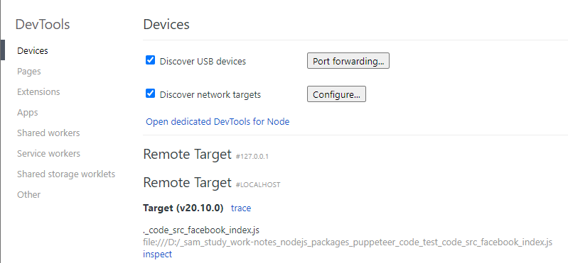
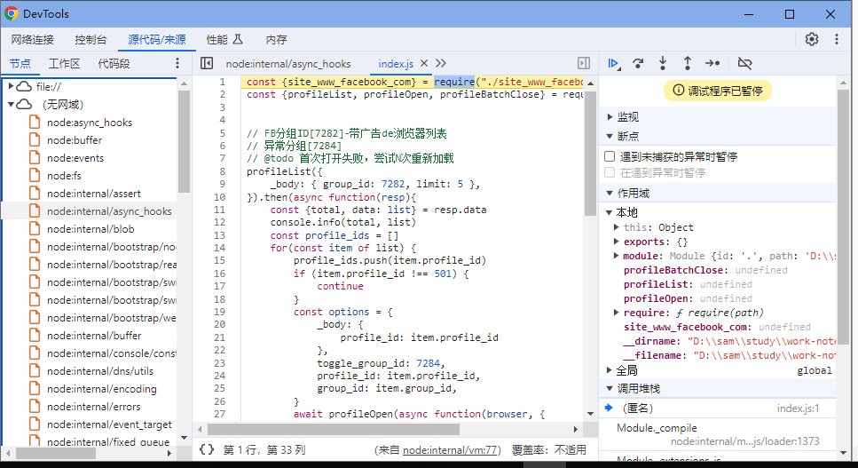
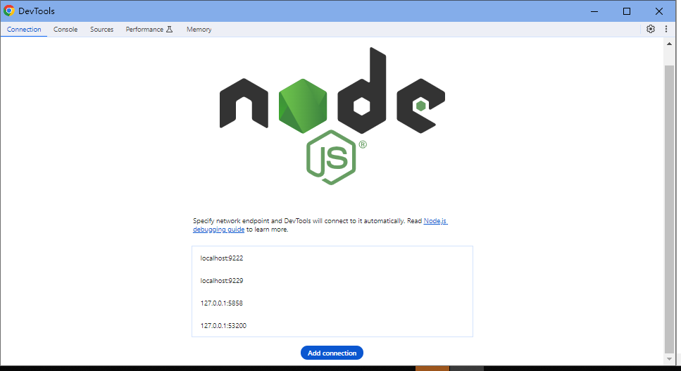
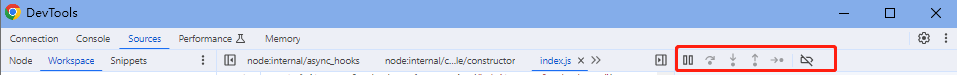
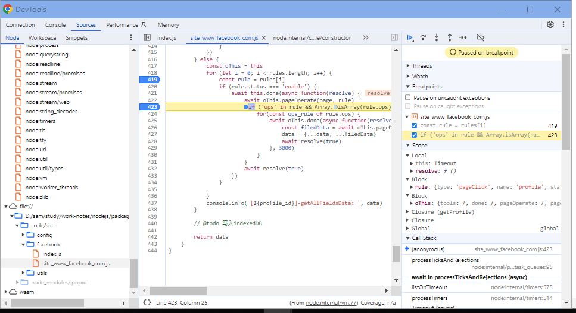

# 100个nodejs问题汇总
## 6、[使用 Chrome Devtools 调试您的 Node.js 程序](https://zhuanlan.zhihu.com/p/338287139)
### 一、运行带有 --inspect-brk 标志的 node
- 启动时在 node 后面加上 --inspect-brk 标志，Node.js 将监听调试客户端，默认情况下监听在 127.0.0.1:9229 地址，也可以显示指定地址 --inspect-brk=_host:port_
- "tfb": ".\\node_modules\\.bin\\node --inspect-brk .\\code\\src\\facebook\\index.js > .\\logs\\facebook.log"
- 注意 node --inspect 与 node --inspect-brk 的区别：--inspect 不会终断，--inspect-brk 在用户代码启动之前会终断，也就是代码在第一行就会暂停执行。
```shell
node --inspect-brk app.js
Debugger listening on ws://127.0.0.1:9229/bf0cee70-d57b-474a-b7d1-4289472e2dc1 
For help, see: https://nodejs.org/en/docs/inspector 
Debugger attached. 
Debugger ending on ws://127.0.0.1:9229/bf0cee70-d57b-474a-b7d1-4289472e2dc1 
For help, see: https://nodejs.org/en/docs/inspector 

```
### 二、在 Chrome 中打开
- 浏览器地址栏输入 `chrome://inspect/` 按回车键，如下所示：

- Remote Target 下展示了当前运行的 Node.js 版本号，打开 inspect 或 Open dedicated Devtools for Node 链接，如下所示：

### 三、断点调试
- [ ] 调试工具窗口介绍
- 上方展示与服务器端调试需要的 5 个面板，和 Chrome 开发工具中的是基本相同的，可以理解为 `“服务端的定制版”`
- connection：连接点
- console：控制台
- sources：源代码调试
- performance：性能
- memory：内存，查找影响性能的内存问题，包括内存泄漏、内存膨胀和频繁的垃圾回收


- Resume script execution(F8): 恢复脚本执行，每一次都会自动执行到断点处。
- Step over next function call(F10)：跳过下一个函数调用，执行当前代码行，在当前代码行的下一行处停止，是一步一步的操作。
- Step into next function call(F11)：单步进入下一个函数调用。
- Step out next function call(F11)：单步退出下一个函数调用。
- Step(F9)：执行当前代码行并在下一行处停止。
- [ ] 设置断点
- 第一种设置断点的方式，是在程序里加入 `debugger` 命令。
- 第二种设置断点的方式是在编辑器窗口中单击要设置的代码行，此时编辑器窗口中该行会处于被选中状态，还有一个右侧的小箭头。另外右下方 Breakpoints 面板中也展示出了我们设置的断点。

### 四、对已启动 Node.js 进程做调试
- [ ] 如果一个 Node.js 进程启动时没有加 --inspect-brk 标志，但是我们又不想重启进程来调试，这个时候怎么办？以下两种方式任何一种都可以：
- 方式一：process._debugProcess(PID)
> 找到当前启动的 Node 进程 ID，之后使用 node -e 'process._debugProcess(26853)' 会建立进程 26853 与调试工具的链接。
```shell
$ ps ax | grep app.js 
26864 s001  S+     0:00.01 grep app.js
26853 s002  S+     0:00.09 node app.js

$ node -e 'process._debugProcess(26853)'
SIGUSR1
```
## 5、[awesome-nodejs](https://github.com/sindresorhus/awesome-nodejs)
## 4、[nest框架](https://docs.nestjs.cn/10/introduction)
## 3、["Uncaught SyntaxError: Cannot use import statement outside a module" when importing ECMAScript 6](https://stackoverflow.com/questions/58211880/uncaught-syntaxerror-cannot-use-import-statement-outside-a-module-when-import)

- [ ] 方案一
  Add "type": "module" to your package.json file.
- [ ] 方案二
```html
<html>
<header>
    <script type="module" src="whatever.js"></script>
</header>
<body></body>
</html>

```
## 2、[require is not defined? Node.js [duplicate]](https://stackoverflow.com/questions/31931614/require-is-not-defined-node-js)

Just remove "type":"module" from your package.json.
## 1、[Browser: Uncaught ReferenceError: require is not defined](https://stackoverflow.com/questions/19059580/browser-uncaught-referenceerror-require-is-not-defined)
`stack overflow 最佳解答`

 This is because require() does not exist in the browser/client-side JavaScript.

Now you're going to have to make some choices about your client-side JavaScript script management.

You have three options:

1. Use the `<script>` tag.
2. Use a [CommonJS](http://wiki.commonjs.org/wiki/CommonJS) implementation. It has synchronous dependencies like Node.js
3. Use an [asynchronous module definition](http://requirejs.org/docs/whyamd.html) (AMD) implementation.

CommonJS client side-implementations include (most of them require a build step before you deploy):

1. [Browserify](https://github.com/substack/node-browserify) - You can use most Node.js modules in the browser. This is my personal favorite.
2. [Webpack](https://webpack.github.io/) - Does everything (bundles JavaScript code, CSS, etc.). It was made popular by the surge of React, but it is notorious for its difficult learning curve.
3. [Rollup](http://rollupjs.org/) - a new contender. It leverages ES6 modules and includes tree-shaking abilities (removes unused code).

You can read more about my comparison of [Browserify vs (deprecated) Component](http://procbits.com/2013/06/17/client-side-javascript-management-browserify-vs-component).

AMD implementations include:

1. [RequireJS](http://requirejs.org/) - Very popular amongst client-side JavaScript developers. It is not my taste because of its asynchronous nature.

Note, in your search for choosing which one to go with, you'll read about Bower. Bower is only for package dependencies and is unopinionated on module definitions like CommonJS and AMD.

