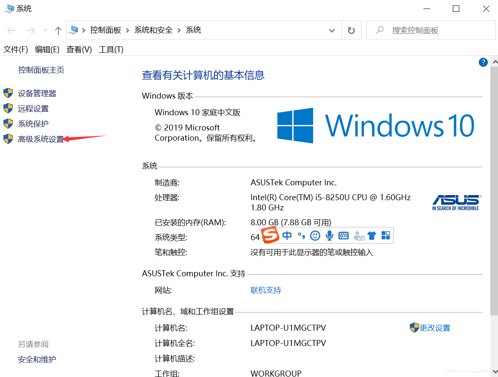
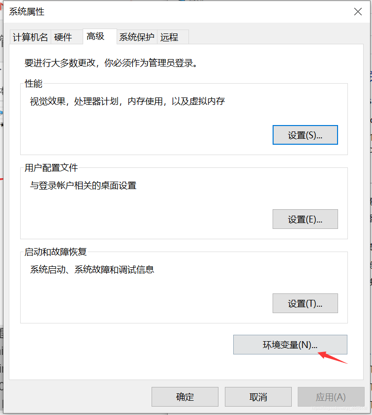
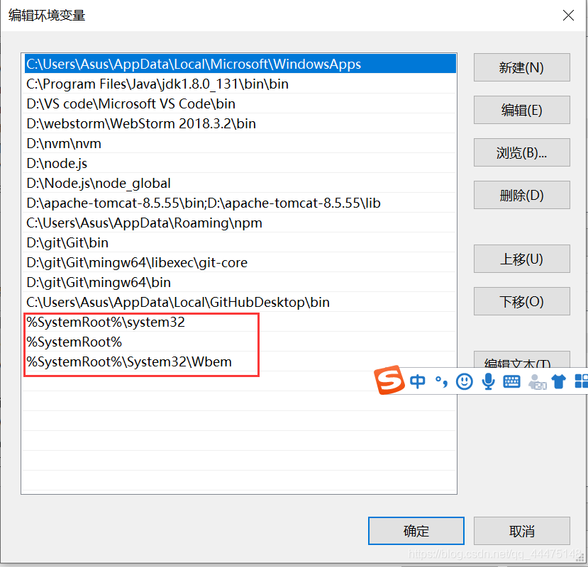

# 关于windows下不能用ping命令的解决方法
## 问题描述：
- [ ] 在Windows 10系统中打开cmd命令框，输入ping 命令显示`‘ping’ 不是内部或外部命令，也不是可运行的程序或批处理文件`。
## 原因分析
- [ ] 在windows的环境配置中误删了系统变量Path的值
## 解决方案
- [ ] 我的电脑->右键点击属性->选择高级系统设置->点击环境变量->找到系统变量Path->添加三条命令即可。

- [ ] 添加完命令后，重新打开一个cmd，输入ping命令，可以看到可以使用了。